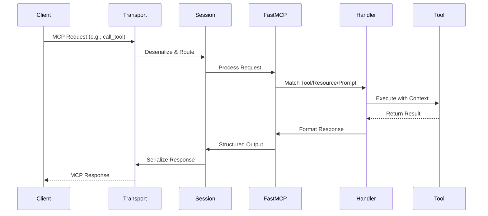
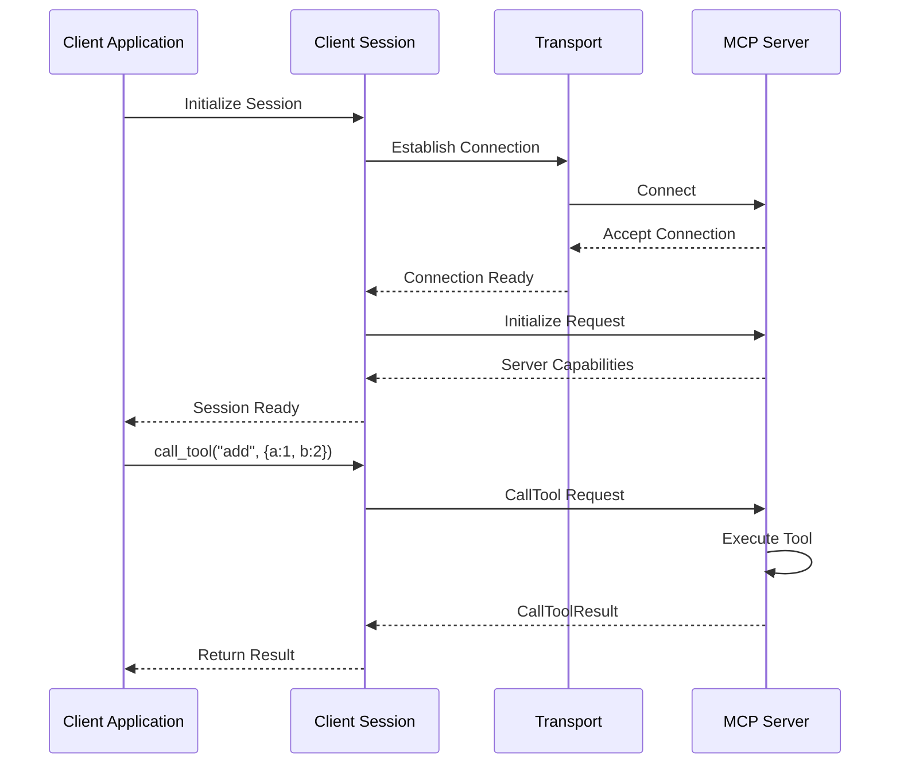

# MCP Python SDK Architecture

This document provides a comprehensive overview of the Model Context Protocol (MCP) Python SDK architecture.

## Architecture Overview

The MCP Python SDK implements the Model Context Protocol specification, providing both client and server capabilities for building AI-powered applications. The SDK is designed with a layered architecture that separates concerns and provides flexibility for different use cases.

## High-Level Architecture Diagram

```mermaid
graph TB
    subgraph "Client Applications"
        LLM[LLM Applications]
        CDE[Claude Desktop]
        Custom[Custom Clients]
    end

    subgraph "MCP Python SDK"
        subgraph "Transport Layer"
            STDIO[stdio Transport]
            SSE[SSE Transport]
            HTTP[Streamable HTTP]
            WS[WebSocket]
        end

        subgraph "Protocol Layer"
            Types[MCP Types & Protocol]
            Session[Session Management]
            Auth[Authentication/OAuth]
        end

        subgraph "Server Implementation"
            FastMCP[FastMCP - High Level]
            LowLevel[Low-Level Server]
            
            subgraph "FastMCP Components"
                Tools[Tool Decorators]
                Resources[Resource Decorators]
                Prompts[Prompt Decorators]
                Context[Context Injection]
                Lifecycle[Lifecycle Management]
            end
        end

        subgraph "Client Implementation"
            ClientSession[Client Session]
            ClientAuth[Client OAuth Provider]
        end

        subgraph "Shared Components"
            Validation[Input Validation]
            Serialization[JSON Serialization]
            Exceptions[Exception Handling]
            Progress[Progress Reporting]
        end
    end

    subgraph "Server Applications"
        MCPServers[MCP Servers]
        FastServers[FastMCP Servers]
        CustomServers[Custom Servers]
    end

    LLM --> STDIO
    CDE --> SSE
    Custom --> HTTP
    Custom --> WS

    STDIO --> Protocol Layer
    SSE --> Protocol Layer
    HTTP --> Protocol Layer
    WS --> Protocol Layer

    Protocol Layer --> ClientSession
    Protocol Layer --> FastMCP
    Protocol Layer --> LowLevel

    ClientSession --> ClientAuth
    FastMCP --> Tools
    FastMCP --> Resources
    FastMCP --> Prompts

    Tools --> Context
    Resources --> Context
    Prompts --> Context

    FastMCP --> Lifecycle
    LowLevel --> Lifecycle

    FastMCP --> MCPServers
    LowLevel --> CustomServers
    FastMCP --> FastServers

    Shared Components -.-> Protocol Layer
    Shared Components -.-> Server Implementation
    Shared Components -.-> Client Implementation

    style FastMCP fill:#90EE90
    style ClientSession fill:#87CEEB
    style Types fill:#FFE4B5
```

## Component Details

### 1. Transport Layer

The transport layer provides multiple communication mechanisms between clients and servers:

- **stdio**: Standard input/output for local process communication
- **SSE (Server-Sent Events)**: Unidirectional server-to-client streaming
- **Streamable HTTP**: Bidirectional HTTP-based communication (recommended for production)
- **WebSocket**: Full-duplex communication channel

### 2. Protocol Layer

The core protocol implementation:

- **MCP Types**: Pydantic models representing all MCP protocol messages
- **Session Management**: Handles connection lifecycle and message routing
- **Authentication**: OAuth 2.1 support for secure communications

### 3. Server Implementation

Two levels of server APIs:

#### FastMCP (High-Level)
- Decorator-based API for quick server development
- Automatic schema generation from type hints
- Built-in context injection for accessing MCP capabilities
- Lifecycle management with lifespan hooks
- Structured output support

#### Low-Level Server
- Direct protocol access for advanced use cases
- Manual handler registration
- Full control over message handling
- Custom capability negotiation

### 4. Client Implementation

- **ClientSession**: High-level client API for connecting to MCP servers
- **OAuth Provider**: Built-in OAuth 2.1 client support
- **Session Groups**: Managing multiple server connections

### 5. Shared Components

Common utilities used across the SDK:

- **Validation**: JSON schema validation for inputs/outputs
- **Serialization**: Pydantic-based JSON serialization
- **Exception Handling**: Unified error handling
- **Progress Reporting**: Progress notification support

## Data Flow Diagrams

### Server Request Flow



### Client Connection Flow



## Key Design Patterns

### 1. Decorator Pattern
FastMCP uses decorators for clean, declarative server definitions:
```python
@mcp.tool()
def my_tool(arg: str) -> str:
    return f"Result: {arg}"
```

### 2. Dependency Injection
Context objects are automatically injected into handlers:
```python
@mcp.tool()
def my_tool(ctx: Context, arg: str) -> str:
    await ctx.info("Processing...")
    return result
```

### 3. Lifespan Management
Async context managers for resource lifecycle:
```python
@asynccontextmanager
async def app_lifespan(server: FastMCP):
    db = await Database.connect()
    try:
        yield AppContext(db=db)
    finally:
        await db.disconnect()
```

### 4. Protocol Abstraction
Transport-agnostic protocol implementation allowing easy switching between transports.

### 5. Type Safety
Extensive use of Pydantic models and type hints for validation and IDE support.

## Module Structure

```
mcp/
├── types.py                    # Protocol type definitions
├── server/
│   ├── fastmcp/               # High-level server API
│   │   ├── server.py          # FastMCP main class
│   │   ├── tools/             # Tool decorators & handlers
│   │   ├── resources/         # Resource decorators & handlers
│   │   └── prompts/           # Prompt decorators & handlers
│   ├── lowlevel/              # Low-level server API
│   │   └── server.py          # Direct protocol handling
│   ├── session.py             # Server session management
│   ├── stdio.py               # stdio transport
│   ├── sse.py                 # SSE transport
│   ├── streamable_http.py     # HTTP transport
│   ├── websocket.py           # WebSocket transport
│   └── auth/                  # OAuth 2.1 server support
├── client/
│   ├── session.py             # Client session
│   ├── stdio/                 # stdio client
│   ├── sse.py                 # SSE client
│   ├── streamable_http.py     # HTTP client
│   ├── websocket.py           # WebSocket client
│   └── auth/                  # OAuth 2.1 client support
└── shared/
    ├── context.py             # Request context
    ├── exceptions.py          # Error handling
    ├── message.py             # Message utilities
    └── progress.py            # Progress reporting
```

## Extension Points

The SDK provides several extension points for customization:

1. **Custom Transports**: Implement new transport mechanisms
2. **Authentication Providers**: Custom OAuth flows or token verification
3. **Custom Validators**: Additional input/output validation
4. **Tool Wrappers**: Middleware for tools, resources, and prompts
5. **Event Hooks**: Lifespan events for initialization and cleanup

## Security Considerations

- **OAuth 2.1 Support**: Built-in authorization for protected resources
- **Transport Security**: HTTPS, WSS support with certificate validation
- **Token Management**: Secure token storage and refresh
- **Input Validation**: Automatic validation via JSON schemas
- **Error Sanitization**: Safe error messages to clients

## Performance Characteristics

- **Async I/O**: Built on anyio for efficient async operations
- **Streaming Support**: Progress notifications and streaming responses
- **Connection Pooling**: HTTP client connection reuse
- **Lazy Loading**: On-demand resource loading
- **Pagination**: Support for large datasets

## Best Practices

1. **Use FastMCP** for most server implementations
2. **Leverage type hints** for automatic schema generation
3. **Implement lifespan hooks** for resource management
4. **Use structured output** for machine-readable results
5. **Handle errors gracefully** with appropriate error types
6. **Report progress** for long-running operations
7. **Use stateless HTTP** for scalable deployments
