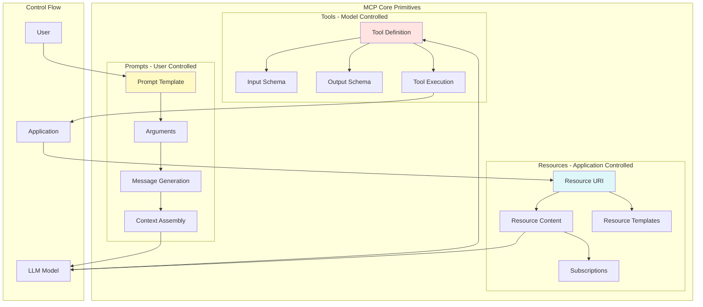
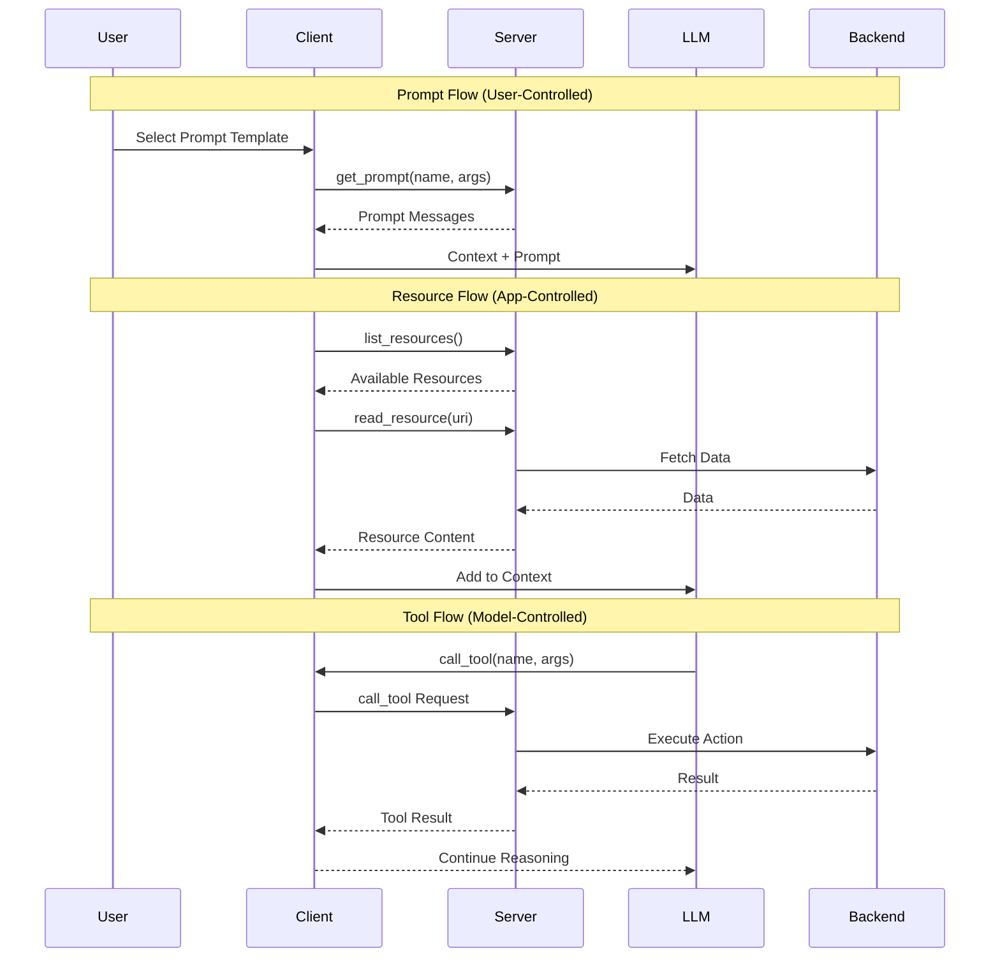
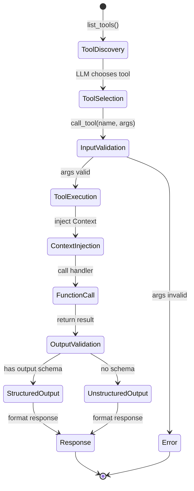
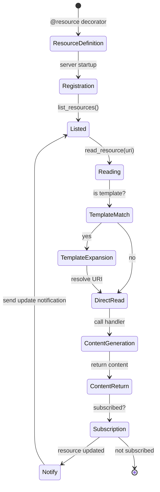
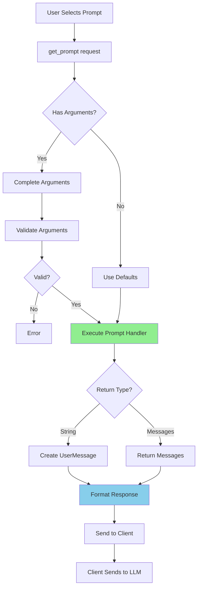
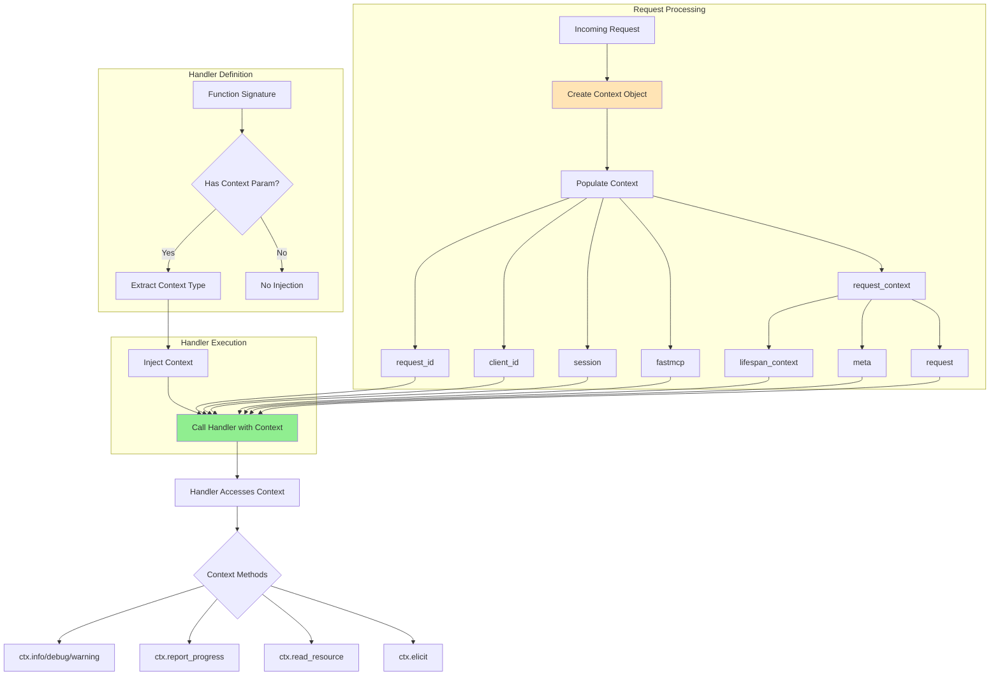
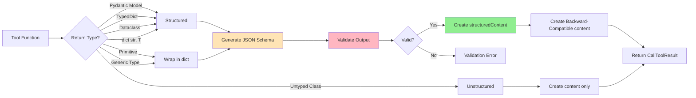
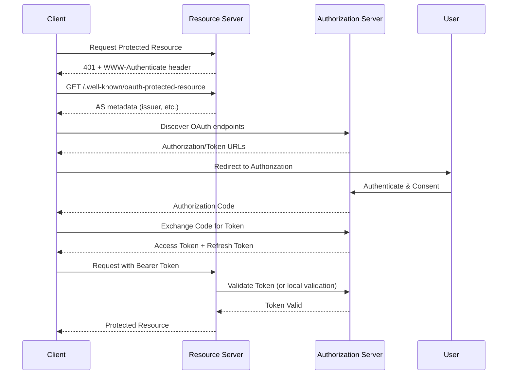

# MCP Protocol Primitives

This document explains the three core primitives of the Model Context Protocol and how they interact within the SDK.

## The Three Primitives



## Primitive Interactions



## Data Flow Through SDK

```mermaid
flowchart LR
    subgraph "Client Side"
        A[Client App] --> B{Request Type?}
        B -->|Tool Call| C[call_tool]
        B -->|Resource Read| D[read_resource]
        B -->|Prompt Get| E[get_prompt]
    end

    subgraph "Transport"
        C --> F[Serialize]
        D --> F
        E --> F
        F --> G[Send over Transport]
        G --> H[Receive Response]
        H --> I[Deserialize]
    end

    subgraph "Server Side"
        J[Route Request] --> K{Handler Type?}
        K -->|Tool| L[@tool decorator]
        K -->|Resource| M[@resource decorator]
        K -->|Prompt| N[@prompt decorator]
        
        L --> O[Execute Function]
        M --> O
        N --> O
        
        O --> P[Generate Response]
        P --> Q[Validate Output]
        Q --> R[Return Result]
    end

    G --> J
    R --> H

    style F fill:#FFE4B5
    style I fill:#FFE4B5
    style O fill:#90EE90
```

## Tool Execution Detail



## Resource Lifecycle



## Prompt Processing



## Context Injection System



## Structured Output Flow



## Authentication Flow



## Summary

These diagrams illustrate:

1. **Three Primitives**: Tools (model-controlled), Resources (app-controlled), Prompts (user-controlled)
2. **Request Flow**: How requests move through the SDK layers
3. **State Machines**: Lifecycle of tools, resources, and prompts
4. **Context System**: How context is injected and used
5. **Structured Output**: Type-based output formatting
6. **Authentication**: OAuth 2.1 flow for protected resources

Each primitive serves a specific purpose in the MCP ecosystem, enabling flexible and powerful AI-application integrations.
